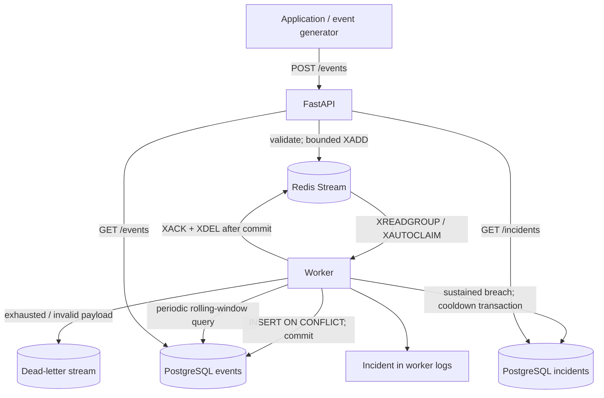

# Cloud Log Ingestion and Incident Detection Service

[](https://github.com/Fahao1/cloud-log-ingestion-incident-detection/actions/workflows/ci.yml)

A small backend for investigating application failures. Applications submit
structured events; developers search persisted logs and inspect incidents when
a service's error ratio remains high. Built with Python, FastAPI, PostgreSQL,
Redis Streams, Docker Compose, pytest, and GitHub Actions.

This is an AI-assisted portfolio project with executable failure tests and
measured local performance. It is not evidence of production operation or cloud
deployment. The repository documents exactly what was adapted and verified.
An [independent audit](docs/audit.md) records reproduced bugs, focused fixes,
fresh-checkout verification, and remaining limits.

## Quick start

Prerequisites: Docker with Compose v2 or newer. The first build needs Internet
access. Ports 8000, 5432, and 6379 must be free.

```sh
cp .env.example .env
docker compose up --build --wait --wait-timeout 180
curl --fail http://localhost:8000/ready
```

Compose starts PostgreSQL and Redis, runs the SQL migrations, then starts the API
and worker. All published ports bind to loopback. The example credentials are
for local development only. Interactive API documentation: [localhost:8000/docs](http://localhost:8000/docs).

Send an event (use a fresh UUID for each distinct event; reuse it for retries):

```sh
curl --fail-with-body -i http://localhost:8000/events \
  -H 'Content-Type: application/json' \
  -d '{
    "event_id": "e85550f0-99bf-43d6-9f46-1846a0719a90",
    "timestamp": "2026-09-27T05:00:00Z",
    "service": "checkout",
    "severity": "ERROR",
    "message": "Payment provider timeout",
    "metadata": {"region": "local", "synthetic": true}
  }'
```

The response is `202 Accepted`, with `status: queued`, `event_id`, `queue_id`,
and the server's `accepted_at`. It confirms Redis acceptance, not a database
commit. Repeating the request produces another delivery but only one stored row.
If multiple payloads use the same ID, the first committed payload wins.

```sh
curl --get http://localhost:8000/events \
  --data-urlencode 'service=checkout' \
  --data-urlencode 'severity=ERROR' \
  --data-urlencode 'q=provider timeout' \
  --data-urlencode 'limit=20'
curl http://localhost:8000/incidents
curl http://localhost:8000/metrics
docker compose logs -f worker
```

Generate a minute of synthetic traffic that can trigger the default incident rule:

```sh
docker compose exec -T api python -m scripts.generate_events --events 120 --interval 0.5
docker compose exec -T api python -m scripts.smoke
```

Stop without removing data: `docker compose down`. PostgreSQL and Redis use
named volumes. **`docker compose down -v` deletes the local data.**

On macOS without Docker Desktop, this project's verified alternative was
Homebrew's `docker`, `docker-compose`, and `colima`, with
`colima start --cpu 4 --memory 6 --disk 30 --vm-type vz`. Homebrew Compose may
need its plugin directory added to Docker's `cliPluginsExtraDirs` configuration.

## Architecture and data flow



1. The API validates a UUID, timezone-aware timestamp, restricted service name,
   severity, message, and optional JSON metadata. The actual received body is
   limited to 16 KiB, including chunked requests. Unknown fields, blank messages,
   NUL/invalid Unicode, and non-finite JSON numbers are rejected.
2. A Redis Lua script atomically checks queue capacity, appends the event with a
   Redis-generated receipt timestamp, and increments the accepted counter. The
   ingestion path does not query PostgreSQL.
3. A worker reads one message at a time from the `persist` consumer group. It
   validates the queue payload, inserts in a database transaction, and waits for
   commit. `events.event_id` is the primary key; `ON CONFLICT DO NOTHING` makes
   duplicate deliveries harmless.
4. Only after success does another Lua script check consumer ownership,
   acknowledge, delete the source entry, and update processing metrics.
5. Each worker periodically attempts the detector transaction. A PostgreSQL
   advisory lock and persisted evaluation timestamp coordinate workers. Incidents
   and cooldown state commit together; created incidents are logged to stdout.

One codebase, two long-running application processes, two backing services, and
a one-shot migration container. There is no separate broker framework, scheduler,
search cluster, frontend, or external alerting account to operate.

## API contract

- `POST /events`: one JSON event; `202` queued, `401` when a configured key is
  missing/wrong, `413` oversized body, `422` invalid input, `503` queue unavailable/full.
- `GET /events`: optional `service`, `severity`, `start`, `end`, `q`, `cursor`,
  and `limit` (1–200, default 50). Time range is **start inclusive, end exclusive**,
  based on the client's event timestamp. Both bounds require timezone information.
- `GET /incidents`: optional `service`, `before_id`, and `limit` (1–200).
- `GET /health`: process liveness only; it stays `200` during dependency outages.
- `GET /ready`: independently checks Redis connectivity and PostgreSQL connectivity
  plus the required schema migration; returns `503` if either check fails.
- `GET /metrics`: Prometheus text format, described below.

Severities: `DEBUG`, `INFO`, `WARNING`, `ERROR`, `CRITICAL` (case-sensitive).
Service names: 1–100 ASCII letters, digits, underscores, dots, or hyphens, starting
with a letter or digit. Messages: 1–8,192 characters, within the whole-body limit.
Metadata: a JSON object; do not send passwords, tokens, or personal data.
Timestamps are normalized to UTC and must remain within years 1–9999 after
conversion. Invalid cursors, NUL-containing filters, and out-of-range dates return 422.

Search results contain `items` and `next_cursor`. Pass `next_cursor` back with the
same filters. Ordering is `(timestamp DESC, event_id DESC)`, so equal timestamps
do not break pagination. This is keyset pagination, not an offset scan or a
snapshot: concurrent backdated inserts can appear in later pages. Changing
filters between pages starts a different logical query.

Text search uses a PostgreSQL generated English `tsvector` and GIN index with
`websearch_to_tsquery`. It searches **message only**, supports words/phrases,
English stemming, OR, and negation. It is not substring, regex, fuzzy, multilingual,
or metadata search; stopwords may produce no matches. SQL parameters protect
filters from injection. B-tree indexes support time, service/time, severity/time,
and detector receipt-time scans. Broad queries may still be expensive; database
statement timeouts bound them. No exact total-count query runs on every page.

Set `API_KEY` in `.env` to protect events, incidents, and metrics with the
`X-API-Key` header, then recreate the application containers. `/health`, `/ready`,
and API docs remain public. Local empty-key mode is intentional. A single shared
key is not multi-user authorization.

## Failure handling and delivery guarantees

**At-least-once attempts, idempotent database effects, bounded retries.** This is
not an exactly-once queue or a guarantee that every accepted event reaches the
events table. Poison messages and exhausted retries are quarantined in the DLQ.

- **Worker dies before commit:** the entry remains in Redis's pending entries
  list. `XAUTOCLAIM` transfers it after `RECLAIM_IDLE_MS` (30 seconds by default).
- **Worker dies after commit, before acknowledgment:** recovery repeats the
  insert. The primary key prevents a duplicate row, then the new owner acknowledges.
- **Database failure:** no success acknowledgment is sent. The entry stays pending
  and is retried after the same idle interval. The reason stores exception class
  and SQLSTATE, without SQL text, credentials, or event contents in logs.
- **Retry limit:** Redis's persisted delivery counter bounds attempts to
  `MAX_ATTEMPTS` (5). Failed attempt 5 moves to DLQ; an entry repeatedly abandoned
  by crashing workers is quarantined when next reclaimed above the limit, without
  another database attempt. These are fixed-delay retries, not exponential backoff.
- **Invalid queue payload:** immediately dead-lettered. API-valid payloads are
  validated again because the queue is a separate trust boundary.
- **Dead letter:** atomic Lua execution appends the original payload, source ID,
  reason, attempts, and failure time to `logs:events:dead`, then acknowledges and
  deletes the source. If the append fails, the source stays pending. Only the
  current consumer may finalize an entry; stale owners cannot acknowledge it.
- **Redis unavailable/full during ingestion:** return `503` and `Retry-After: 1`;
  there is no in-memory fallback. A lost response can be ambiguous—the append may
  have succeeded. Retry with the same event ID. An HTTP timeout is similarly ambiguous.
- **Redis unavailable after commit:** the row remains stored; the worker retries
  acknowledgment through normal recovery when Redis returns.
- **Overload:** the stream is capped by an atomic capacity check (100,000 entries),
  not `MAXLEN` trimming. Redis additionally has a 256 MiB limit with `noeviction`;
  whichever limit is reached first rejects writes. Slow/pending events are not
  deliberately removed to make room. Successful entries are deleted, so stream
  length includes both unread and pending backlog.
- **Redis logical memory pressure:** ingestion still rejects new writes. Consumer
  finalization and small retry/failure records use Redis Lua's `allow-oom` flag
  so existing work can drain, including movement to the DLQ. These bounded
  per-delivery operations can temporarily exceed `maxmemory`; it is not a hard
  process memory cap. DLQ storage still requires operator-owned retention and
  headroom. Physical RAM exhaustion, a container memory kill, disk-full errors,
  or missing stream/group state under OOM still require operator recovery.

Redis runs with AOF `appendfsync everysec`. A host/Redis crash can lose roughly the
last second of writes, including events already acknowledged to HTTP clients;
storage failure can lose more. PostgreSQL retains its default durable commits.
There is no distributed transaction between Redis and PostgreSQL. On pathological
timing (a long-paused worker or a crash after the final database commit), a DLQ
entry can correspond to an already-persisted event. Replaying the original ID
is safe; exactly-once delivery is not claimed. Clock rollback and long worker
pauses can extend recovery times. Keep systems time-synchronized.

This implementation owns exactly **one consumer group** on its stream. Because
successful entries are deleted, adding another group would need a different
retention policy. Do not manually trim the stream or delete pending entries.

Inspect dead letters:

```sh
docker compose exec redis redis-cli XRANGE logs:events:dead - + COUNT 10
```

Resolve the cause and POST a dead letter's `data` JSON to `/events` with its
original `event_id`. Confirm persistence before manually deleting its DLQ entry.
DLQ entries have no automatic expiration: monitor/archive them and control access
because they contain log payloads. API acceptance never silently drops a DLQ item.

## Incident rule

Defaults: every **5 seconds**, for each service, examine persisted events accepted
in the last **60 seconds**. A breach requires all three:

- at least **20 total events**;
- at least **5 ERROR or CRITICAL events**;
- error fraction **at least 25%**.

The breach must remain true at each scheduled evaluation for **30 seconds**
before an incident opens. A **300-second per-service cooldown** suppresses
duplicates, including across restarts and concurrent workers. An ongoing breach
can create another incident after the cooldown. A healthy/empty window clears
the sustain timer. A gap longer than twice the evaluation interval also restarts
the timer because missing observations cannot establish continuity.

This is a configurable sustained threshold detector, **not adaptive anomaly
detection or a comparison with a historical baseline**. It samples rolling
windows; it cannot prove the threshold held between samples. It uses server
receipt time to avoid client clock errors. Replaying old client timestamps with
new UUIDs counts as new traffic and can trigger current incidents. Retrying an
already-stored UUID preserves its original receipt time and does not add a row.
Detection only sees committed events, so a storage backlog
can delay or suppress alerts when receipts age out of the window.

Incidents retain observed counts, ratio, breach start, open time, and the complete
rule configuration. They are immutable occurrence records, not an acknowledgment,
resolution, or escalation workflow. The alert is persisted and emitted in worker
logs; `GET /incidents` works without an external account. Webhook delivery is
deliberately omitted; add an outbox-backed notifier if external delivery is needed.
Stdout notification can be lost after commit; the incident remains queryable.

All configuration is listed in [.env.example](.env.example). Important groups:

- Storage/auth: `DATABASE_URL`, `REDIS_URL`, `API_KEY`.
- Queue safety: `MAX_REQUEST_BYTES`, `QUEUE_CAPACITY`, `RECLAIM_IDLE_MS`, `MAX_ATTEMPTS`.
- SQL deadline: `DB_TIMEOUT_MS`. Reclaim idle time must exceed this by more than
  3 seconds. One-at-a-time consumption avoids aging an unprocessed local batch.
- Rule: `ALERT_WINDOW_SECONDS`, `ALERT_MIN_EVENTS`, `ALERT_MIN_ERRORS`,
  `ALERT_ERROR_RATIO`, `ALERT_SUSTAIN_SECONDS`, `ALERT_COOLDOWN_SECONDS`,
  `ALERT_CHECK_SECONDS`. Recreate workers after changes. Resetting rule state when
  changing a production policy would need an explicit policy-version migration.

## Operations

`/metrics` aggregates counters in Redis across API/worker instances:

- `logservice_accepted_events_total`: queued deliveries, including duplicates.
- `logservice_processed_messages_total`: successfully finalized deliveries.
- `logservice_duplicate_deliveries_total`: finalized deliveries whose insert
  encountered an existing UUID, including recovery after a committed write.
- `logservice_retries_total`: idle pending messages reclaimed for another attempt.
- `logservice_dead_lettered_events_total`, `logservice_database_failures_total`.
- `logservice_queue_backlog`: unread plus pending entries, not merely the pending list.
- `logservice_pending_messages`, `logservice_dead_letter_backlog`.
- `logservice_processing_delay_seconds`: cumulative histogram from Redis acceptance
  to acknowledgment after database commit. It includes duplicate/retry deliveries.

Counters reflect Redis finalization, not an audit-grade unique-event ledger. A
commit/ack crash can shift an insertion into the duplicate count. Metrics reset
if their Redis data is removed; no Prometheus server is bundled. Readiness checks
connectivity/schema, not worker freshness, free disk, queue headroom, or Redis
durability. Monitor queue growth, DLQ growth, delay, detector logs, disk, and memory.

Run more workers with `docker compose up -d --scale worker=2`. Every process has
a unique consumer name. The SQL primary key and detector advisory lock provide
cross-worker coordination. Scale only after measuring the actual bottleneck.

## Tests and local development

Use Python 3.13 (the version tested locally and in CI). With backing services running:

```sh
make install
make check
make test          # dependency-free tests; explicitly skips integration tests
make integration   # runs ALL tests with real PostgreSQL and Redis
```

`make install` creates `.venv`, installs the pinned `requirements.lock`, and
installs this project in editable mode. The same Make targets run in GitHub
Actions. Integration tests create a uniquely named temporary PostgreSQL database
and isolated Redis keys, then remove them. The test PostgreSQL user needs
`CREATEDB`; never point test settings at production. No mock Redis/SQLite
substitutes are used in the integration suite.
The memory-pressure regression temporarily changes Redis's **server-wide**
`maxmemory` and restores it in `finally`; use disposable development/CI services
without unrelated clients. These tests are not intended for parallel pytest runs.

Coverage includes validation/size/auth, real ingestion and search, tied-timestamp
pagination, concurrent duplicate delivery, commit/ack crash recovery, abandoned
pending entries, transient SQL failures, bounded dead letters, poison messages,
capacity protection, stale-owner fencing, sustained incidents, service isolation,
cooldown, detector gaps, and repeatable migrations. SQL failures are injected
with a real PostgreSQL trigger; the commit/ack disconnect is injected at that
precise boundary. These are deterministic boundary tests, not a claim to cover
every OS/network failure.

To run application processes directly instead of containers:

```sh
docker compose up -d postgres redis
.venv/bin/python -m app.migrate
.venv/bin/uvicorn app.main:app --port 8000 --no-access-log
# In another terminal:
.venv/bin/python -m app.worker
```

Stop existing Compose API/worker containers first to avoid a port conflict or
unexpected extra worker. SQL files in `migrations/` apply in lexical order in a
transaction protected by an advisory lock; versions are recorded in
`schema_migrations`. Add new migrations instead of editing deployed ones. There
are no down-migrations: restore a backup or write a forward migration.

CI has two jobs: formatting/linting plus all pytest tests against service
containers, and a fresh Compose build/start plus the HTTP smoke test. See
[verification evidence](docs/verification.md) and the live CI badge above.
One upstream Starlette test-client deprecation warning is currently visible;
it does not represent a failing test.

## Reproducible load test

```sh
make install
docker compose up --build -d --scale worker=1
.venv/bin/python -m scripts.load_test \
  --events 2000 --concurrency 16 --message-bytes 512 --workers 1 \
  --environment 'describe your CPU, RAM, OS, VM limits, and runtime here' \
  --output artifacts/load.json
```

The script sends distinct UUIDs at closed-loop concurrency 16, with 25% ERROR
events and otherwise INFO. It observes committed rows over a separate PostgreSQL
connection and saves every latency sample, source file hashes, counts, errors,
payload sizes, durations, and percentile results. Runs use an isolated synthetic
service name; data is retained. `--workers` records the actual worker count; it
does not start workers. `make load` is the equivalent default workload.

Acceptance throughput = successful `202` responses / submission duration.
Persistence throughput = observed committed rows / elapsed time through the
final observation. Latency = PostgreSQL's first committed-row observation time
minus Redis's receipt timestamp, **not** HTTP round-trip time or the client's
event timestamp. The script does not use `stored_at`, which is assigned before
commit. Redis/PostgreSQL share the VM clock in the recorded run. Across machines,
clock synchronization is required.

Polling requests a 10 ms interval, but query time, client scheduling, and growing
result sets make actual gaps larger; measured median/p95 gaps are in each result.
Reported latencies are **upper bounds on acceptance-to-commit latency**, inclusive
of observation overhead. The observer re-reads each run's rows for correctness
under out-of-order commits; it can affect throughput and should be redesigned
for million-event tests. Percentiles use nearest rank; median uses the usual
middle-value average. Incomplete/error/negative-latency runs exit nonzero after
saving partial evidence. `--timeout` (120 seconds by default) bounds connection,
submission, and observation work together; cancellation joins outstanding tasks.
A canceled HTTP request may already have reached Redis, so partial runs cannot
establish the total number of events accepted by the server.

**Historical baseline, before the audit fixes:** on an Apple M4 Pro with a
4-vCPU/6-GiB Colima VM, three 2,000-event
bursts accepted and persisted all 6,000 events with zero request failures. One
worker achieved **566–570 persisted events/second**, with per-run median
acceptance-to-observed-commit latency **16.7–17.7 ms** and p95 **40.8–43.1 ms**.
Each burst lasted approximately 3.5 seconds at concurrency 16 with 765–766-byte
JSON payloads. Actual polling gaps were about 29–30 ms at the median, included
in the latency upper bounds above.

Hardware, exact commands, all runs, and raw measurements are in
[docs/benchmark.md](docs/benchmark.md). These are local burst measurements,
not production capacity or a sustained-load SLA.

## Reuse and engineering tradeoffs

Before building, we searched public projects for ingestion, Streams workers,
search, and alerting components. A small MIT-licensed consumer-group setup and
PostgreSQL search pattern from `log-observability` were adapted. `redis-py` is an
installed dependency. Alertmanager was considered but not incorporated.
[THIRD_PARTY.md](THIRD_PARTY.md) records URLs, commit hashes, maintenance evidence,
exact adapted files, changes, and required copyright/license notices.

- **Plain SQL + psycopg:** the queries and transaction boundaries are visible
  during review/interviews. An ORM would add another layer for a small schema.
- **PostgreSQL search:** one durable store serves investigation and detection;
  dedicated search infrastructure is unnecessary for the measured workload.
- **Redis Streams:** built-in pending tracking/reclaim supplies recovery without
  a separate task framework. It introduces a second persistence boundary and
  explicit AOF durability limitations.
- **Small Lua scripts:** capacity and ownership/finalization must be atomic
  across workers. Scripts are limited to Redis state; they cannot make SQL and
  Redis a single transaction.
- **One event per transaction:** simple failure isolation and bounded local work.
  Batch inserts could improve throughput but complicate poison-event isolation
  and lease management. Measure first.
- **Persistent detector state:** more reliable than in-memory cooldowns, with a
  single global detector lock. It scans a rolling window and historical service
  state; aggregate time buckets and partitioned detector work are the upgrade
  path when this becomes expensive.
- **Pinned Python dependencies:** repeatable installs using the same lockfile in
  Docker, local development, and CI. Container tags track supported patch releases;
  recorded versions are in the benchmark, but images are not digest-pinned.

## Limits and deployment

Not yet provided: multi-tenant isolation, per-application keys/quotas, TLS
termination, retention jobs or partitions, automated DLQ replay, backups,
replication/failover, dashboards, external notifications, incident resolution,
adaptive baselines, OTLP compatibility, or a long-running soak/failover test.
Log content and metadata are stored as submitted; no automatic PII/secret
redaction is claimed. The image and documented local command disable Uvicorn
access logs because search URLs can contain sensitive terms. Configure any
reverse proxy to omit query strings and credentials from its own logs. Worker
incident logs include service names and counts; dead letters retain original
payloads (possibly non-UTF-8 bytes). All event/incident/DLQ history requires an operator-owned
retention policy. More consumer groups and Redis Cluster are unsupported by
the current key/script layout.

**No cloud deployment has been performed.** Deployment preparation is the
non-root Docker image, runtime environment settings, migration command,
health/readiness endpoints, and deployment procedure:

1. Provision private PostgreSQL and Redis 7.2+ services; confirm Streams/Lua
   support and a deliberate persistence/backup policy. Avoid eviction of queue data.
2. Build and push the Docker image to your chosen registry. Run
   `python -m app.migrate` once as a release job before starting application tasks.
3. Start the image's default command for the API and `python -m app.worker` for
   workers, with reachable `DATABASE_URL`/`REDIS_URL`. Use TLS URLs where supported.
4. Set a strong `API_KEY` and rotated database credentials in the platform secret
   store. Put an HTTPS reverse proxy/load balancer in front with body limits,
   request timeouts, connection limits, and rate limits. Do not expose databases.
5. Probe `/health` for liveness and `/ready` for readiness. Scrape metrics with the
   API key, collect worker logs, and alert on backlog, DLQ, dependency errors, and disk.
6. Run the smoke/integration/load procedures in a nonproduction environment,
   exercise restore/replay, and establish retention and availability requirements
   before sending real application logs.

## Publishing and interview use

The public repository is [Fahao1/cloud-log-ingestion-incident-detection](https://github.com/Fahao1/cloud-log-ingestion-incident-detection).
Before publishing, `.env`, environments, caches, build artifacts, and arbitrary
load outputs are ignored; only deliberate synthetic benchmark evidence is
checked in. Required adapted-code notices are included in source and image.

If publishing your own copy:

```sh
git init -b main
git add .
git diff --cached --check
git commit -m "Build log ingestion and incident detection service"
gh auth login
gh repo create cloud-log-ingestion-incident-detection --public --source=. --remote=origin --push
gh run list
```

Update the badge/repository URLs to your account. Review the staged files for
secrets and preserve `THIRD_PARTY.md` and `licenses/`.

For interviews, start with `app/main.py`, follow `app/queue.py` → `app/worker.py`
→ `app/db.py`, then explain `app/detector.py` and the commit-before-ack tests.
Be ready to explain why a `202` is not a durable SQL commit, why replay is safe,
why pending-only metrics miss unread backlog, and why a pre-commit timestamp is
not a valid commit-latency measurement. [Resume notes](docs/resume.md) keep claims
limited to the implementation and evidence in this repository.
